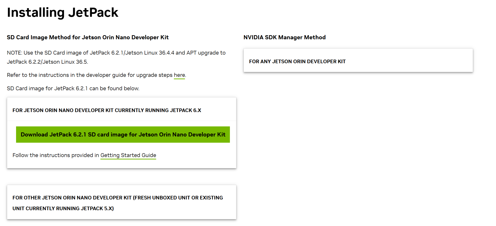
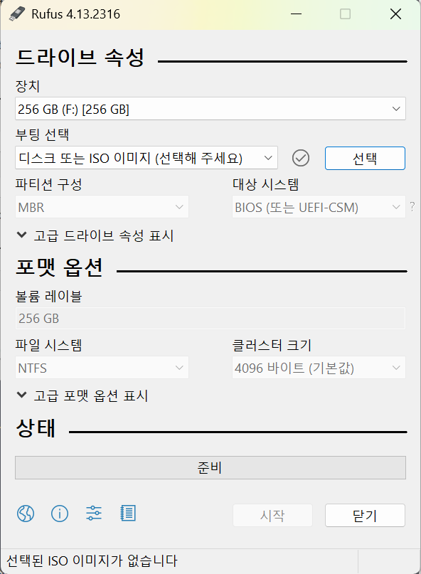
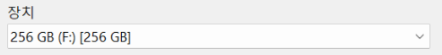
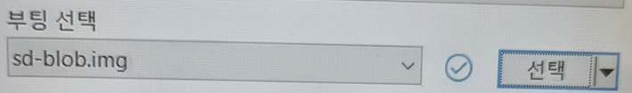
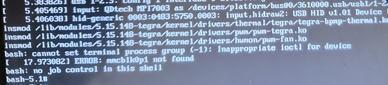
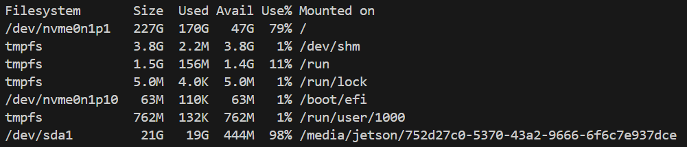
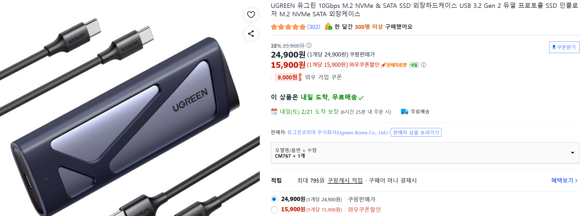

# SSD에 jetpack 6.2.1 버전 설치해서 orin nano에서 실행시키기 (mmcblk0p1 not found)

## 날짜 및 목표
26.02.22

jetson orin에 호환되는 jetpack 7 버전이 26년 2분기에 출시하기 때문에, 6.2.1 버전을 설치해서 orin nano에서 실행시켜 보자. 
## 1. SSD에 jetpack 6.2.1 버전 설치까지
- jetpack 6.2.1 버전 이미지 다운로드
  -  링크 : https://developer.nvidia.com/embedded/jetpack-sdk-622
  -  
     -  Install JetPack에서 For Jetson Orin Nano Developer Kit currently running JetPack 6.x 선택
     -  누르면 나오는 녹색 버튼 클릭해서 다운로드
- jetpack 6.2.1 버전 이미지 설치
  - rufus로 jetpack 6.2.1 버전 이미지 설치
    -  rufus 다운로드
       -  rufus 실행
       -  
       -  장치 선택 및 jetpack 6.2.1 버전 이미지(sd-blob.img) 선택
       -  
       -  
       -  시작 클릭하면 rufus가 자동으로 포맷 및 이미지 설치 진행

## 2. 이제 orin nano에 ssd를 연결해서 부팅하면 문제가 생길 것이다.
-  부팅 시 mmcblk0p1 not found 에러 발생
- 
   - 보이는가? ERROR: nmcblk0p1 not found 라고 뜨는 것을.
   - mmcblk0p1은 Jetson의 내부 SD 카드 슬롯을 가리키는 이름이다.
   - 이미지 내부에 정의된 부팅 경로가 여전히 SD 카드로 고정되어 있는 것이다.
   - 그래서 Jetson이 SSD에서 부팅하려고 시도하지만, SD 카드가 없어서 mmcblk0p1을 찾을 수 없다고 에러가 나는 것.

## 3. 해결 방법 - 리눅스 PC에 SSD 연결해서 boot 디렉토리 수정하기
  -  NVIDIA 공식 SDK를 사용해도 되지만, 개귀찮다. 그래서 간단한 방법으로 해결해보자.
  -  그건 바로 리눅스 PC에 SSD를 연결해서 boot 디렉토리 안의 부팅 설정 파일을 수정하는 것이다.
  - ### 1) SSD를 리눅스 PC에 연결하기
      -  SSD를 리눅스 PC에 연결한다.
      -  df -h 명령어로 연결된 디스크 확인하기
      - 
      - /dev/sda1이 바로 리눅스 PC가 SSD에 설치된 파티션을 마운트한 것.
  - ### 2) 이제 SSD의 boot 디렉토리로 이동해서 부팅 설정 파일 수정하기
    -  cd /media/jetson/752d27c0-5370-43a2-9666-6f6c7e937dce/boot/extlinux
    -  ls 명령어로 파일 확인하기
    -  extlinux.conf 파일이 보이는가? 이 파일이 바로 부팅 과정에서 부트로더가 커널을 어떻게 로드하고, 어떤 파티션을 루트 파일 시스템으로 마운트할지 정의하는 설정 파일이다.
    -  이제 extlinux.conf 파일을 편집기로 열어서 수정하자.
    -  root=/dev/mmcblk0p1 문구를 root=/dev/nvme0n1p1로 수정
    -  이제 잘 실행될 것이다.

## 4. 트리비아
- ### 1) 왜 SSD를 리눅스 PC에 연결해서 수정하는가?
  - Jetson의 OS 이미지는 EXT4 파일 시스템으로 포맷되어 있고, 리눅스 PC는 EXT4를 읽을 수 있는 드라이버가 자동으로 설치되어 있기 때문에, SSD를 연결하면 자동으로 마운트되고 파일 시스템이 인식되는 것이다.
  - 자동 마운트 : 우분투에는 새로운 저장장치가 연결되면 파티션 구조를 분석해서 자동으로 사용자가 쓸 수 있게 연결해주는 UDisks 서비스가 작동
- ### 2) root=/dev/nvme0n1은 안정적인가?
  -  SSD가 2개 이상 연결될 경우 문제가 생길 수 있기 때문에, root=PARTUUID=xxxx-xxxx-xxxx-xxxx 형식으로 수정하는 것이 더 안정적이다.
  -  SSD가 다른 이름으로 인식될 수도 있기 때문에, 리눅스 PC에서 lsblk 명령어로 연결된 디스크와 파티션을 확인해서 정확한 장치 이름을 찾아야 한다.
  -  찾는 법 : sudo blkid 명령어로 파티션의 UUID를 확인할 수 있다. 예를 들어, /dev/sda1의 UUID가 1234-5678이라면, extlinux.conf 파일에서 root=PARTUUID=1234-5678로 수정하면 된다.
- ### 3) SSD를 USB 장치로 PC에 연결하기
  - 
  - 이걸로 연결했음 ㅇㅇ;